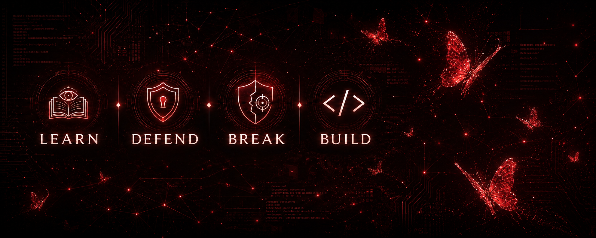

# So—you’ve found my little corner of GitHub. 🍷✨

> **Welcome in. Try not to break anything—I’m handling that part.**

I'm Gabby, a Computer Science student specializing in Network and Information Security. This is my personal GitHub, and I only recently started building it, so yes, I may have decorated the place before actually moving anything in.

I'm mainly interested in cybersecurity, especially red teaming. I'm working my way there by strengthening my defensive security and security operations foundations, while also learning how security is handled in professional and corporate environments. That currently means coursework, labs, experiments, a lot of documentation, and occasionally explaining a technical idea until it finally stops sounding like alphabet soup.

Most of what I share here will revolve around cybersecurity, but I may also add software projects or anything else that makes me curious enough to try it. This is a personal portfolio, so it will probably wander a little.

## Toolkit

